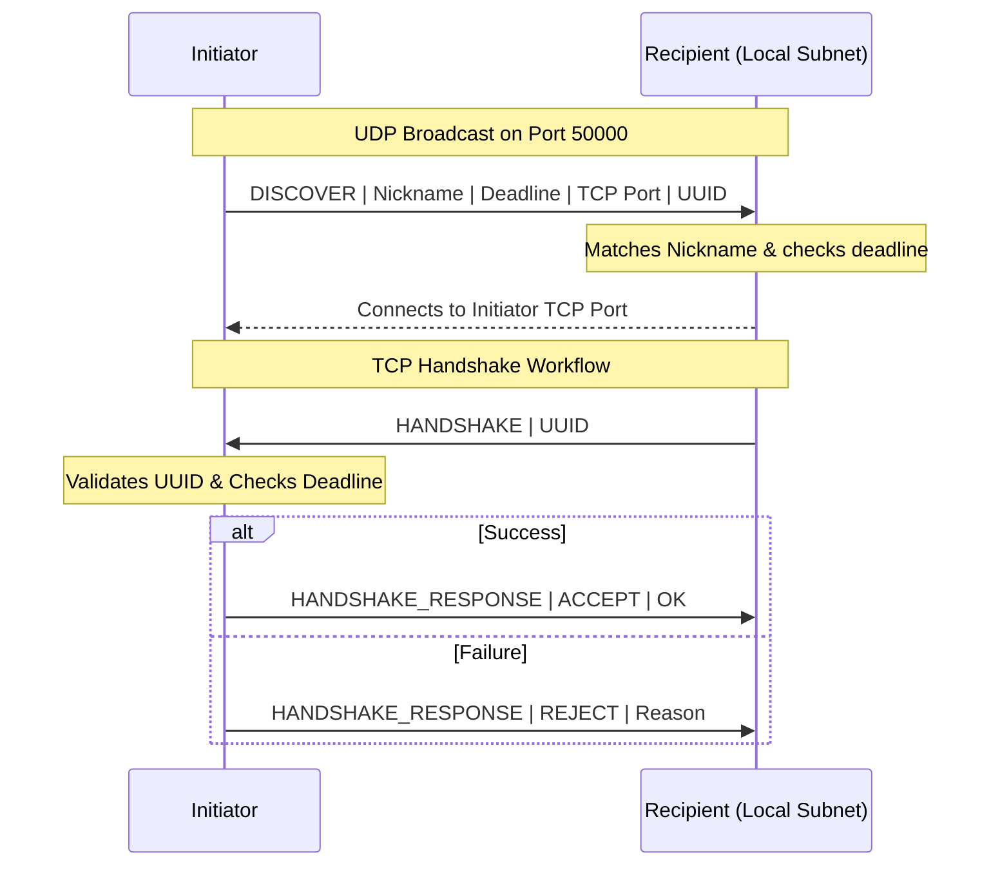
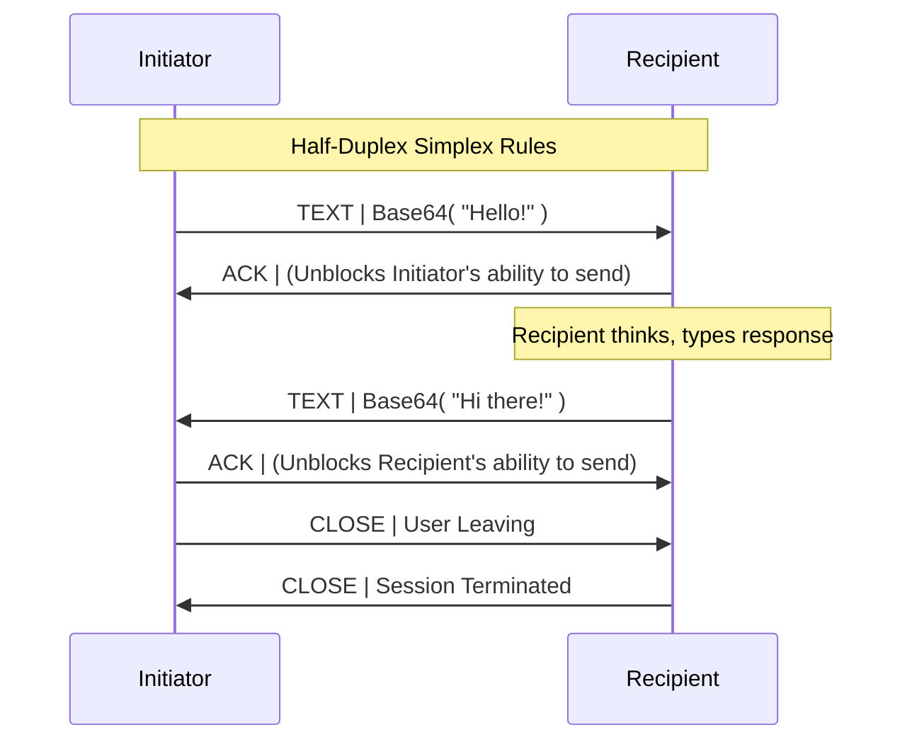

# Local Network Chat Protocol Project Report


---

## 1. Project Overview (README)

A custom application-layer chat protocol implemented in Python, designed for peer-to-peer communication over a local network.

This project implements the **Simple Local Network Chat Protocol (SLNCP)**. It features a decentralized discovery mechanism using UDP broadcasts and a reliable, half-duplex chat stream over TCP.

### Key Features
- **UDP Discovery:** Locates peers on the local subnet by nickname.
- **TCP Handshake:** Validates connections using a unique UUID and a discovery deadline.
- **Simplex Message Exchange:** Strict half-duplex communication rules (one message at a time).
- **Base64 Encoding:** Ensures message payloads never conflict with protocol delimiters.
- **Clean Termination:** Synchronized connection closure on both ends.

### Prerequisites
- Python 3.x

### How to Use

**1. Start the Recipient**
The recipient listens for discovery broadcasts and responds if the nickname matches.
```bash
python recipient.py <Your_Nickname>
# Example:
python recipient.py Habiba
```

**2. Start the Initiator**
The initiator sends a broadcast to find a specific peer and establishes the connection.
```bash
python initiator.py <Target_Nickname> <Timeout_Seconds>
# Example:
python initiator.py Habiba 60
```

**3. Chatting**
- Type your message and press **Enter**.
- You must wait for the peer's response (or an implicit ACK) before sending your next message.
- Type `exit` to close the connection.

### Files
- `protocol.py`: Core protocol definitions and encoding logic.
- `initiator.py`: The application that starts the communication.
- `recipient.py`: The application that receives and responds to requests.
- `chat_session.py`: Manages the interactive terminal chat loop.
- `Protocol_Specification.md`: Technical documentation of the protocol design.

---

## 2. Protocol Specification

### Overview and Design Goals
The Simple Local Network Chat Protocol (SLNCP) is a lightweight, custom application-layer protocol designed to facilitate direct peer-to-peer chat communication over a local area network (LAN). It combines connectionless discovery parameters with a reliable bidirectional interaction stream. 

**Main Design Goals:**
- **Simplicity:** Provide an easily understandable, human-readable text-based framework delimited by common symbols.
- **Reliability in Transport Session:** Leverage TCP's built-in reliability guarantees allowing minimal error detection overhead in handling individual messages.
- **Synchronized Simplex Workflow (Half-Duplex):** Enforce strict alternations or synchronized flow logic implicitly requiring message acknowledgment.
- **Clean Addressing:** Base64-encoded payloads to completely void collisions with delimiter tokens or unhandled character behaviors spanning across varying operating systems.

### Inspiration and Research
The SLNCP design draws inspiration from existing application-layer protocols:
- **SMTP/FTP:** Inherits the human-readable command-response structure using simple text prefixes.
- **HTTP:** Employs the concept of headers/metadata (UUID, Deadline) preceding the core exchange.
- **UDP Discovery Patterns:** Similar to SSDP or DHCP discovery, using broad-spectrum announcements to locate localized control nodes.

### Description of All Message Types
The framework abstracts communications around five strict prefixes (plus CLOSE):
1. `DISCOVER` (UDP) – Broadcast message locating a target on the local subnet by nickname. Carries connection deadline and transport negotiation parameters.
2. `HANDSHAKE` (TCP) – Recipient-driven mechanism binding correctly mapped UUID requests, effectively blocking stale or unauthorized connection attempts.
3. `HANDSHAKE_RESPONSE` (TCP) – Initiator validation signaling TCP payload progression to standard chat or an abrupt drop.
4. `TEXT` (TCP) – Active user-submitted communication payload traversing the established socket securely encoded via Base64.
5. `ACK` (TCP) – A lightweight synchronization beacon explicitly verifying logical reception of a `TEXT` payload to coordinate the half-duplex interaction restriction.
6. `CLOSE` (TCP) – Terminal transmission indicating session teardown. 

### Message Format Definitions

All TCP and UDP logical string constructs operate on UTF-8 character encoding delimited by the pipe character `|` and concluding strictly with a trailing newline `\n`.

#### Message Structure: UDP Broadcast
| Message Prefix | Arg 1 | Arg 2 | Arg 3 | Arg 4 |
| :--- | :--- | :--- | :--- | :--- |
| `DISCOVER` | `Target_Nickname` | `Unix_Timestamp_Deadline` | `Host_TCP_Port` | `Request_UUID` |
*Example: `DISCOVER|Alice|1683401010.5|49152|1234abcd-12ab... \n`*

#### Message Structures: TCP Exchange
| Message Prefix | Arg 1 | Arg 2 | Purpose |
| :--- | :--- | :--- | :--- |
| `HANDSHAKE` | `Request_UUID` | - | Attempt authentication of discovery UUID |
| `HANDSHAKE_RESPONSE`| `Status` (ACCEPT/REJECT) | `Reason_String` | Accept or Deny verification sequence |
| `TEXT` | `Base64_Payload` | - | Standard encapsulated chat token |
| `ACK` | - | - | Half-Duplex logical synchronization marker |
| `CLOSE` | `Reason_String` | - | Trigger clean socket invalidation |

### Communication Workflow Diagrams

#### Discovery and Connection Workflow


#### Message Exchange Workflow


### Error Handling & Assumptions
* **Timeout & Expiration Filtering:** Recipient disregards any incoming UDP packet whose referenced timestamp is exceeded. On connection, the Initiator evaluates system time natively, terminating late `HANDSHAKE` requests immediately.
* **Network Partition / Missing Segments:** Employs basic OS TCP Stack fault tolerances (`socket.settimeout()`) discarding orphaned channels automatically resetting state variables correctly. Assumes TCP inherently secures transmission sequencing and integrity between endpoints.
* **Collisions & Incompatible Characters:** The `TEXT` body enforces zero dependency on specific text arrangements since Base64 transforms the entirety without colliding with our reserved pipe (`|`) delimiter.
* **Malicious Discovery Strings:** The parameters heavily validate schema matching natively enforcing exact positional index structures. Uncastable inputs trigger implicit continue loops disregarding faulty network structures dynamically mapping safe continuous deployment processes.
